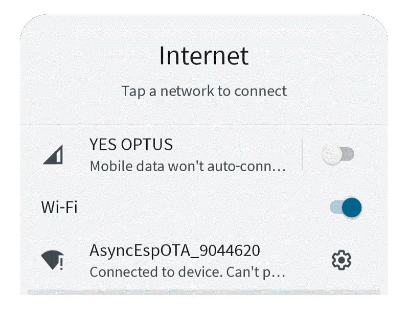

# AsyncEspOTA
## Introduction
This library aims to provide an easy way to install firmware and SPIFFS/littleFS/FatFS filesystem data onto your ESP32 Over The Air (OTA).  It provides a web interface from which you can download and install multiple different projects, each with multiple different versions.

When the the largest example sketch has been loaded into an esp32 via the Arduino IDE and a USB cable it will broadcast an SSID of `AsyncEspOTA_xxxxxx` (where xxxxx is the serial number of the esp32 microContorller) with a password of `123456789`.  Once connected to that WiFi Network, simply browse to 192.168.4.1 (or your esp32s insert_SSID_name.local/ ) to view the IoTEasiestOTAforEndUsers home page.  This page has 2 hyperlinks to the same page; 
	One is an IP address, (which at that time will be `0.0.0.0`) - because the esp has not connected to any WiFi network.
	The other is a multicastDNS url, that will begin with the SSID just connected to and a suffix of `.local/` ie: `AsyncEspOTA_xxxxxx.local/` which can be used from Apple iPhone, iPad, Mac, Linux,  Android 12 (and later) and Windows computers with 
	Apple's Bonjour driver installed.  Earlier versions Android don't support mDNS .
The home page also contains a `Wifi Settings` button and an `Update Firmware` button and some dummy buttons for your project to expand into that will simply return a 404 page not found error message.

Clicking on the `Wifi Settings` button will show a web page that will allow you and your customers or users to setup WiFi connections for up to 30 WiFi Networks (number can be changed in the library if you need more :O or less).   
Click the Save button for each added network in the browser and then reboot the module.  
It will attempt to connect to the any of the provided WiFi Networks that are in radio range.  
If none are found it will only be reachable via the SSID it is broadcasting.

For those familiar with  Arduino WiFi programming, the obvious ommission from the sketch AND Library code is any hard coded variable values for SSIDs and Passwords of WiFi networks the ESP32 should connect to.  This is deliberate!!  Due to the provisioning sequence described above, the end user provides SSID and Password values via a web page - served up by the ESP32, so no SSID and Passwords need to be hard coded in the programme.  This library uses `Espressif's Preferences` library to save multiple SSIDs and Passwords the user enters and stores them in the `NVS RAM` of the ESP32.  This area of memory data is retained across loss of power and Reboot cycles.
<p align="center">
    
</p>

## Features
- `TODO: Install via Arduino IDE Library Manager`
- Easiest IoT device to provision:
	- Manually add SSID/Password credentials
	- Scan WiFi networks in local area and show signal strength  (`NB: ESP32 is only capable of 2.4GHz`)
	- Connect to any scanned network with connect button
	- Edit and delete saved credentials
	- Saved networks show signal strength
	- Connect to any saved WiFi Network in range
	- `TODO add auto-reconnect button to give preference to a particular network??`
- Save up to 30 SSID/Password credentials and automatically connect to any that are in range
- 100% Web interface after initial commisioning
- Perform OTA updates from predefined Repositories
- Perform OTA updates from custom URL
- `TODO: Perform OTA updates from files on a browser's Local filesystem`
- Complete working IoT example code with compiled demo repository of 4 apps with multiple versions each on gitHub.
(All demos are the same example sketch, for simplicity's sake.)
- Example sketch can be used as a launchpad for any IoT project

## Getting started
### Prerequisites
Before installing anything you'll need your esp32 to be ready. This involves having installed an additional Arduino board manager.
The process is quite easy and can be found in the following link:
https://github.com/espressif/arduino-esp32/blob/master/docs/arduino-ide/boards_manager.md

You will also need the following libraries whcih are not accessible via the arduino IDE library manager:
- Requires AsyncTCP		https://github.com/me-no-dev/ESPAsyncTCP
- Requires AsyncWebServer	https://github.com/me-no-dev/AsyncWebServer
- `Requires WebSocketsServer	TODO: convert code to use AsyncWebServer library for webSockets too!!` 
- Requires ESPmDNS		
- Requires FS
- Requires HTTPClient
- Requires HTTPUpdate
- Requires Preferences
- Requires SPIFFS
- Requires Update
- Requires WiFi
- Requires WiFiClientSecure

You will also need the AsyncWebServer Library from https://github.com/me-no-dev/AsyncWebServer and AsyncTCP library from https://github.com/me-no-dev/ESPAsyncTCP
`TODO: and WebSocketsServer library from  (Delete and use webSockets already inside https://github.com/me-no-dev/AsyncWebServer)`.
These libraries are not only for the OTAUpdate process, but they form the foundation of an Iot approach to Arduino app development where no client apps need to be writtern for specific hardware platforms (iOS, Android, Linus, Windows, Mac).  Eveything is hosted in the esp32 and a browser on any modern Operating System with WiFi capabilities can access the features and functions of the microController as long and said operating system supports mDNS.

### Installing
- `TODO: Use Arduino IDE Library Manager and search for AsyncEspOTA and click Install.`
- `TODO: In Arduino IDE go to File->Examples and search for AsyncEspOTA->IoTEasiestOTAforEndUsers.`

### Important: you need to pick a partition scheme for the project that allows for OTA updates.
Let say you want to install [app1](https://github.com/linzmeister/AsyncEspOTA/tree/main/DemoRepo/app1) via AsyncEspOTA. As this project needs a "Minimal SPIFFS" use partition scheme (1.9MB APP with OTA and 190KB SPIFFS), you'll need to select this type of partition in Arduino IDE `Tools -> Partition Scheme` menu.  Then you can click on the upload button of your Arduino IDE.
`TODO: Add coreDump to Flash ROM and send to browser client/another web server 
custom  Partitiopn files  including coreDump
Provide custom bootrom files to copy into Arduino IDE sdk for flashing`

## Usage
`TODO: verify if mDNS causes data connection problems without being a WiFiClient itself.`
When the example sketches are loaded into an ESP32, it will broadcast an SSID and you should be able to connect via you web browser at an address similar to: 
`http://AsyncEspOTA_xxxxx.local/firmware` where `xxxxx` is the serial number of your esp32 dev board.
This works from Apple Mac, Apple iPad/iPhone, Linux, Windows with Bonjour installed, and Android version 12 or greater.

mDNS does not work on older Android devices before version 12.  On old Android devices you must browse to ```192.168.4.1```.

You can change the SSID broadcast to your product name by editing the variables in the sketch's header file:
```
const char *ssidPrefix = "AsyncEspOTA_";
const char *APpassword = "123456789";
```

Your sketch must also contain object references to an AsyncWebServer called webServer ( and currently a webSocket Server and const int called wsPort )
```
AsyncWebServer webServer;

`TODO:  delete and convert to AsyncWebServers webSockets!!`
WebSocketsServer webSocket;	

`TODO:  delete and convert to AsyncWebServers webSockets!!  uses ws://hostname/path/ws instead of a different port` 
const int wsPort;
```

By setting some boolean values in your sketch, you the developer can control where users are able to source their updated firmware:
```
bool allowInternet = true;
bool allowCustomPaths = false;
bool allowLocal = false;
const char *appsURL= "https://some.webServerAccessibleToTheUser.com/product/file/path/apps.json";
```

All the variables above are declared as extern in the library, so you must use those exact variable names - the values (apart from webServer and webSocket) are at your discretion.

The example above restricts them to only getting firmware updates from `appsURL`which is another extern declared variable that you have hard coded into the sketch.  These boolean values control whether certain portion of html are sent to the users browser.  Any portions not sent, prevents them from loading firmware from unauthorised locations.

From here simply use the browser interface provided to select WiFi networks to connect to and projects you wish to install.  

If you add this library and supporting sketch code to all of your projects, you'll be able to update your esp32 from one app to the next easily.  To distribute a product to end users, set the appsURL in the sketch header file to a ```different apps.json file``` which contains ```only the entries`` you wish end users to access.  By this means, you could have a generic apps.json file for yourself and when you commission a product for an end user, you can lock them into only getting updates for the product they have pruchased.

The ```IoTEasiestOTAforEndUsers``` example sketch forms the foundation of a browser based application waiting for you to add your own web pages, SQL client, data/sensor acquisition, SDCard storage and whatever your imagination or solution requires.

### How can I add my project to the repo list?
- Create a new gitHub repository (or a publicly accessible folder on any website) and upload an `apps.json` file.
- Update the ```const char *appsURL = ``` variable in the sketch to the url of the apps.json file.
- Ensure apps.json file contains the following JSON (JavaScript Object Notation) format:

```
[{
	"name": "yourAwesomeProject",
	"description" : "The world's easiest IoT device for END USERS to configure and provision WiFi with OTA updates",
	"repoRawPath" : "https://raw.githubusercontent.com/YourUserName/yourAwesomeProject/main/versions/",
	"SPIFFSFilename": "",
	"BinFilename" : "someFileName.bin"
},	
{
	"name": "aSecondAwesomeProjectWithSpiffs",
	"description": "A short description",
	"repoRawPath": "https://raw.githubusercontent.com/YourUserName/aSecondAwesomeProjectWithSpiffs/forkXYZ/releases/",
	"SPIFFSFilename":"spiffs.bin_Or_ADifferentFilename.bin",
	"BinFilename":"anotherFilename.bin"
}]
```

The `repoRawPath` should be a fully qualified domain name and folder path to the directory where the `versions.json` file and all published version folders are.  See versions.json file description below.

The `repoRawPath` folder on the server must contain a subfolder for each of your released versions.
Each version folder must contain a bin File.  It may contain a spiffs file if the SPIFFSfilename is not an empty string.

Paths to different apps can be anywhere on the internet - they don't have to be on the same server.

`SPIFFSFilename value` can be an empty string, if SPIFFS is not required for the project, but you can not delete the `SPIFFSFilename key` without causing an error.  The value of `SPIFFSFilename` may be `spiffs.bin`, or any other filename you wish to create.  If the `apps.json` record for an app contains a SPIFFSFilename vale that is not an empty string, every version must contain a valid spiffs file or an error will occur.

The library does have some simple graphics for signal strength and encryption which are pre-loaded into a spiffs file, so if you want to use them, you will need to supply a spiffs file.  If you do not supply a spiffs file, the `alt text` will be displayed on the WiFi settings page.. ie instead of 4 green arcs, you will see: `|||||` and instead of a padlock image you will see: `C` or `O`.

'BinFileName' value must be provided, cannot be an empty String and can be anything you wish to call it. 

```
yourAwesomeProject
    |_ versions
        |_ versions.json
        |_ 0.9.6
        |   |_ appName.bin
        |_ 1.0.0
        |   |_ appName.bin
        |_ 1.2
            |_ appName.bin

aSecondAwesomeProjectWithSpiffs
    |_releases
        |_ versions.json
        |_ 1.0.6
        |   |_ fw.bin
        |   |_ spiffs.bin
        |_ 1.4.83
        |   |_ fw.bin
        |   |_ spiffs.bin
        |_ 1.5.16
            |_ fw.bin
            |_ spiffs.bin
```

It's up to you if you want to provide multiple version of your project. All you have to do is add a  record  to the `versions.json` file, that matches your versions folder st ructure.  In the above example, your `versions.json` for yourAwesomeProject will need to contain the following:
```
[{
    "version": 1.2,
    "build": 1,
    "current": true,
    "partitionScheme":"min_spiffs",
    "description": "Awesome new feature xyz!",
    "compatibility": [1.0]
},{
    "version": 1.0.0,
    "build": 1,
    "current": false,
    "partitionScheme":"min_spiffs",
    "description": "First public release!",
    "compatibility": []
},{
    "version": 0.9.6,
    "build": 1,
    "current": false,
    "partitionScheme":"min_spiffs",
    "description": "Intial beta version",
    "compatibility": []
}]
```

A different versions.json file would be required in the root directory of aSecondAwesomeProjectWithSpiffs.
```
[{
    "version": 1.5.16,
    "build": 1,
    "current": true,
    "partitionScheme":"min_spiffs",
    "description": "Awesome new feature xyz!",
    "compatibility": [1.4]
},{
    "version": 1.4.83,
    "build": 1,
    "current": false,
    "partitionScheme":"min_spiffs",
    "description": "Now with more awesomeness - at no extra cost",
    "compatibility": []
},{
    "version": 1.0.6a,
    "build": 1,
    "current": false,
    "partitionScheme":"min_spiffs",
    "description": "A fantastic new app that does everything",
    "compatibility": []
}]
```


## `TO DO`
- [ ] Support FFat update
- [ ] Add Partition scheme check?
- [ ] Add filter to search through repo list
